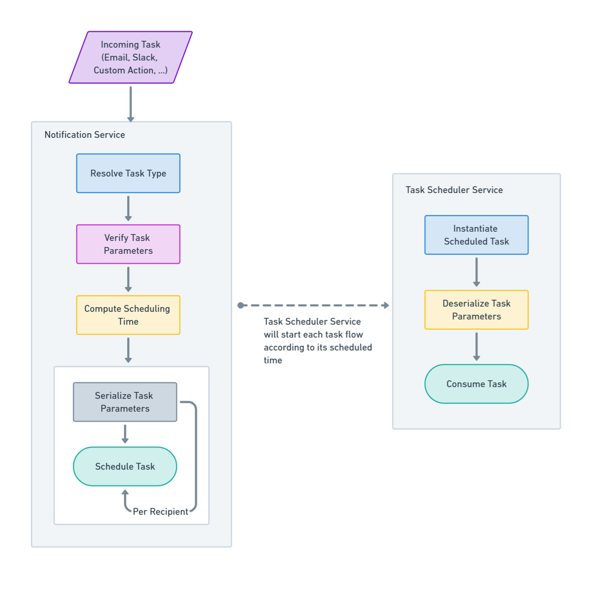

## Workflow

### When a scheduled task is about to be started by the Task Scheduler Service, the following steps are executed:

1. Create a new instance of the task consumer class.
2. Deserialize the scheduler concrete task parameters and assign them to the task instance.
3. Resolve the task's configured template message based on the appropriate language or locale.
4. Replace the template message placeholders with the task parameters.
5. Convert the template message into the final message string.
6. Configure the target consumer output SDK (e.g., email or Slack SDK).
7. Dispatch the message to the target recipient using the configured SDK.

---