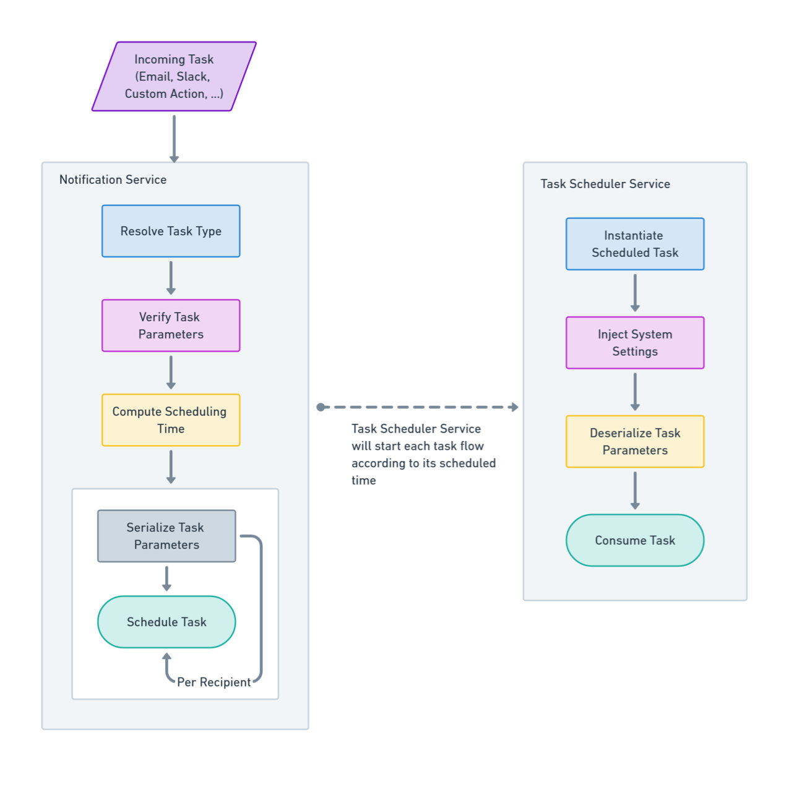
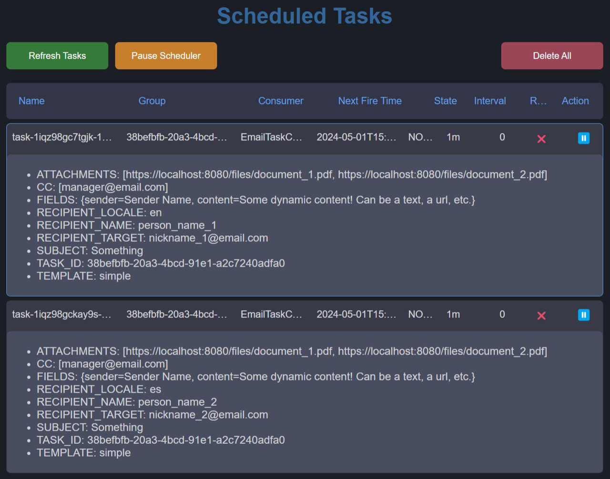

# [KTask](https://github.com/perracodex/KTask)

A [Quartz](https://github.com/quartz-scheduler) scheduler based notification system using the [Ktor](https://ktor.io/) framework.

---

## Preface

[KTask](https://github.com/perracodex/KTask) serves as a comprehensive example of a scheduler-based notification system.
It showcases dispatching of tasks at scheduled times, for example sending emails, Slack messages, or any other custom action.

The system allows for scheduling tasks to be sent either immediately or at a specified future time to multiple recipients.
If a task is sent with a past date, it will be dispatched either immediately or at the next available time.

For functionality, and concretely for the supplied notification samples, the necessary credentials must be configured
either for Email and/or Slack services. These credentials should be specified in the project's `application.conf` and `env` files.

---

## Features

* Scheduling: Configure notifications for immediate delivery or scheduled for future deployment.
* Extendable: Dispatch notifications either via email or Slack. Easily extendable to other types of notifications or custom actions.
* Templates: Send notifications using dynamic templates for both HTML emails or rich Slack messages
* Multi-Language: Support for sending notifications in different languages, as long as the templates are provided.
* Administration: View, pause, resume, and delete scheduled tasks through dedicated REST endpoints.
* Dashboard: A dashboard sample is available to view and manage scheduled tasks.
* Audit: Keep track of all tasks execution history.
* Micro-Metrics: Ready for integration with monitoring tools like Prometheus or Grafana.

---
For convenience, it is included a *[Postman Collection](./.postman/ktask.postman_collection.json)* with all the available REST endpoints.

For credentials `Basic Authentication` is used. Default: `admin` / `admin`.
See: [security.conf](./ktask-base/src/main/resources/config/config_security.conf)

---

## Workflow



### When a scheduled task is about to be started by the Task Scheduler Service, the following steps are executed:

1. Create a new instance of the task consumer class.
2. Inject the App Settings into the task instance, enabling access to output SDK configuration settings.
3. Deserialize the scheduler concrete task parameters and assign them to the task instance.
4. Resolve the task's configured template message based on the appropriate language or locale.
5. Replace the template message placeholders with the task parameters.
6. Convert the template message into the final message string.
7. Configure the target consumer output SDK (e.g., email or Slack SDK).
8. Dispatch the message to the target recipient using the configured SDK.

---

## Dashboard

A simple dashboard to view and manage scheduled tasks is available at the endpoint: `/scheduler/dashboard`



---

## Language Support

The system supports sending notifications in multiple languages or locales.
The desired language or locale can be specified within the recipient object.
For this feature to function correctly, templates must be provided in the corresponding language or locale.

```json
{
  "recipients": [
    {
      "target": "person_1_email",
      "name": "person_name_1",
      "language": "en"
    },
    {
      "target": "person_1_email",
      "name": "person_name_1",
      "language": "en-us"
    },
    {
      "target": "person_1_email",
      "name": "person_name_1",
      "language": "es"
    }
  ]
}
```

* The system will automatically use the appropriate template based on the specified language or locale.

* Templates must be stored in the project's root directory under the [public_templates](./public_templates) folder.

* If a language-specific template is not found, the notification will not be sent until the template is provided.

* New templates will be recognized and utilized without requiring a server restart.

---

## Message Template Fields

A typical email json request object looks like next, where the `fields` object can contain any dynamic data
that intended to replace placeholders in the target template.

```json
{
  "id": "38befbfb-20a3-4bcd-91e1-a2c7240adfa0",
  "recipients": [
    {
      "target": "nickname_1@email.com",
      "name": "person_name_1",
      "language": "en"
    },
    {
      "target": "nickname_2@email.com",
      "name": "person_name_2",
      "language": "es"
    }
  ],
  "template": "simple",
  "cc": [],
  "attachments": [],
  "subject": "Something",
  "fields": {
    "sender": "Sender Name",
    "content": "Some dynamic content!"
  }
}
```

* The `fields` items can be customized based on a target template.
*
* The target template must contain the corresponding placeholders, which are the `fields` items keys.

* If any of the `fields` items are not found in a target template, they will be ignored.

* Not specifying the `fields` object will result in the template being sent as is.

---

## Cron Expressions

For cron expressions refer to: [Quartz Cron Expression Documentation](http://www.quartz-scheduler.org/documentation/quartz-2.3.0/tutorials/crontrigger.html)

For a friendly interface to generate cron expressions, refer to:

* [Cron Maker](http://www.cronmaker.com/)
* [Cron Expression Generator](https://www.freeformatter.com/cron-expression-generator-quartz.html)

A cron expression is composed of the following fields:

```
┌───────────── second (0-59)
│ ┌───────────── minute (0-59)
│ │ ┌───────────── hour (0-23)
│ │ │ ┌───────────── day of month (1-31)
│ │ │ │ ┌───────────── month (1-12 or JAN-DEC)
│ │ │ │ │ ┌───────────── weekday (0-7, SUN-SAT. Both 0 and 7 mean Sunday)
│ │ │ │ │ │ ┌───────────── year (optional)
│ │ │ │ │ │ │
│ │ │ │ │ │ │
* * * * * * *
```

Sample expressions:

```
"0 0 0 * * ?" - At midnight every day.
"0 0 12 ? * MON-FRI" - At noon every weekday.
"0 0/30 9-17 * * ?" - Every 30 minutes between 9 AM to 5 PM.
"0 0 0 1 * ?" - At midnight on the first day of every month.
"0 0 6 ? * SUN" - At 6 AM every Sunday.
"0 0 14 * * ?" - At 2 PM every day.
"0 15 10 ? * *" - At 10:15 AM every day.
"0 0/15 * * * ?" - Every 15 minutes.
"0 0 0 ? * MON#1" - At midnight on the first Monday of every month.
"30 0 0 * * ?" - At 00:00:30 (30 seconds past midnight) every day.
"0/1 * * * * ?" - Every second.
"0 * * * * ?" - Every minute.
```

---

## Notification Endpoints

### Email

- **Description**: Send or schedule an email notification.
- **Endpoint**: `POST /push/email`

Immediate dispatch

```json
{
  "id": "38befbfb-20a3-4bcd-91e1-a2c7240adfa0",
  "recipients": [
    {
      "target": "nickname_1@email.com",
      "name": "person_name_1",
      "language": "en"
    },
    {
      "target": "nickname_2@email.com",
      "name": "person_name_2",
      "language": "es"
    }
  ],
  "template": "simple",
  "cc": [],
  "attachments": [],
  "subject": "Something",
  "fields": {
    "sender": "Sender Name",
    "content": "Some dynamic content!"
  }
}
```

Interval dispatch

```json
{
  "id": "38befbfb-20a3-4bcd-91e1-a2c7240adfa0",
  "schedule": {
    "start": "2024-05-01T15:42:50",
    "days": 0,
    "hours": 0,
    "minutes": 1,
    "seconds": 0
  },
  "recipients": [
    {
      "target": "nickname_1@email.com",
      "name": "person_name_1",
      "language": "en"
    },
    {
      "target": "nickname_2@email.com",
      "name": "person_name_2",
      "language": "es"
    }
  ],
  "template": "simple",
  "cc": [],
  "attachments": [],
  "subject": "Something",
  "fields": {
    "sender": "Sender Name",
    "content": "Some dynamic content!"
  }
}
```

Cron dispatch

```json
{
  "id": "38befbfb-20a3-4bcd-91e1-a2c7240adfa0",
  "schedule": {
    "start": "2024-05-01T15:42:50",
    "cron": "0 * * * * ?"
  },
  "recipients": [
    {
      "target": "nickname_1@email.com",
      "name": "person_name_1",
      "language": "en"
    },
    {
      "target": "nickname_2@email.com",
      "name": "person_name_2",
      "language": "es"
    }
  ],
  "template": "simple",
  "cc": [],
  "attachments": [],
  "sender": "Sender Name",
  "fields": {
    "sender": "Sender Name",
    "content": "Some dynamic content!"
  }
}
```

### Slack

- **Description**: Send or schedule a Slack notification.
- **Endpoint**: `POST /push/slack`

Immediate dispatch

```json
{
  "id": "38befbfb-20a3-4bcd-91e1-a2c7240adfa0",
  "recipients": [
    {
      "target": "nickname_1@email.com",
      "name": "person_name_1",
      "language": "en"
    },
    {
      "target": "nickname_2@email.com",
      "name": "person_name_2",
      "language": "es"
    }
  ],
  "template": "simple",
  "channel": "SLACK_CHANNEL_ID",
  "attachments": [],
  "fields": {
    "sender": "Sender Name",
    "content": "Some dynamic content!"
  }
}
```

Interval dispatch

```json
{
  "id": "38befbfb-20a3-4bcd-91e1-a2c7240adfa0",
  "schedule": {
    "start": "2024-05-01T15:42:50",
    "days": 0,
    "hours": 0,
    "minutes": 1,
    "seconds": 0
  },
  "recipients": [
    {
      "target": "nickname_1@email.com",
      "name": "person_name_1",
      "language": "en"
    },
    {
      "target": "nickname_2@email.com",
      "name": "person_name_2",
      "language": "es"
    }
  ],
  "template": "simple",
  "channel": "SLACK_CHANNEL_ID",
  "attachments": [],
  "fields": {
    "sender": "Sender Name",
    "content": "Some dynamic content!"
  }
}
```

Cron dispatch

```json
{
  "id": "38befbfb-20a3-4bcd-91e1-a2c7240adfa0",
  "schedule": {
    "start": "2024-05-01T15:42:50",
    "cron": "0 * * * * ?"
  },
  "recipients": [
    {
      "target": "person_1_slack_id",
      "name": "person_name_1",
      "language": "en"
    },
    {
      "target": "person_2_slack_id",
      "name": "person_name_2",
      "language": "es"
    }
  ],
  "template": "simple",
  "channel": "SLACK_CHANNEL_ID",
  "attachments": [],
  "fields": {
    "sender": "Sender Name",
    "content": "Some dynamic content!"
  }
}
```

---

## Administration Endpoints

### List Scheduled Tasks

- **Description**: Retrieve a list of all scheduled tasks.
- **Endpoint**: `GET /scheduler/task`
- **Sample Output**

```json
[
  {
    "name": "task-1iqz98gc7tg2k-137337807472199",
    "group": "38befbfb-20a3-4bcd-91e1-a2c7240adfa0",
    "consumer": "EmailTaskConsumer",
    "nextFireTime": "2024-06-11T11:53:50",
    "state": "NORMAL",
    "interval": "1d",
    "runs": 17,
    "dataMap": [
      "ATTACHMENTS: [https://localhost:8080/files/document_1.pdf, https://localhost:8080/files/document_2.pdf]",
      "CC: [manager@email.com]",
      "FIELDS: {sender=Sender Name, content=Some dynamic content! Can be a text, a url, etc.}",
      "RECIPIENT_LOCALE: en",
      "RECIPIENT_NAME: person_name_1",
      "RECIPIENT_TARGET: nickname_1@email.com",
      "SUBJECT: Something",
      "TASK_ID: 38befbfb-20a3-4bcd-91e1-a2c7240adfa0",
      "TEMPLATE: simple"
    ]
  }
]
```

### List Task Groups

- **Description**: Retrieve a list of task groups.
- **Endpoint**: `GET /scheduler/task/group`
- **Sample Output**

```json
[
  "38befbfb-20a3-4bcd-91e1-a2c7240adfa0",
  "72512d82-622f-4c3f-9355-990f938c12f7"
]
```

### Pause/Resume Scheduled Tasks

- **Endpoint**: `POST /scheduler/task/{taskId}/{taskGroup}/pause`
- **Endpoint**: `POST /scheduler/task/{taskId}/{taskGroup}/resume`

**Sample Output**

```json
{
  "totalAffected": 0,
  "alreadyInState": 0,
  "totalTasks": 2,
  "state": "NORMAL"
}
```

### Delete Scheduled Tasks

- **Endpoint**: `DELETE /scheduler/task`
- **Endpoint**: `DELETE /scheduler/task/{taskId}/{taskGroup}`
- **Output**: Total number of tasks deleted.

### Pause/Resume the Scheduled Service

- **Endpoint**: `POST /scheduler/pause`
- **Endpoint**: `POST /scheduler/resume`

**Sample Output**

```json
{
  "totalAffected": 0,
  "alreadyInState": 0,
  "totalTasks": 2,
  "state": "RUNNING"
}
```

### Get State of the Scheduled Service

- **Endpoint**: `POST /scheduler/state`
- **Output**: `RUNNING`, `PAUSED`, `STOPPED`

### Restart (reboot) the Scheduled Service

- **Endpoint**: `POST /scheduler/restart`

Optionally, can specify a boolean parameter to indicate whether actively executing tasks should be interrupted.
The default value is `false`, meaning the scheduler will await for the executing tasks to finish before restarting.
